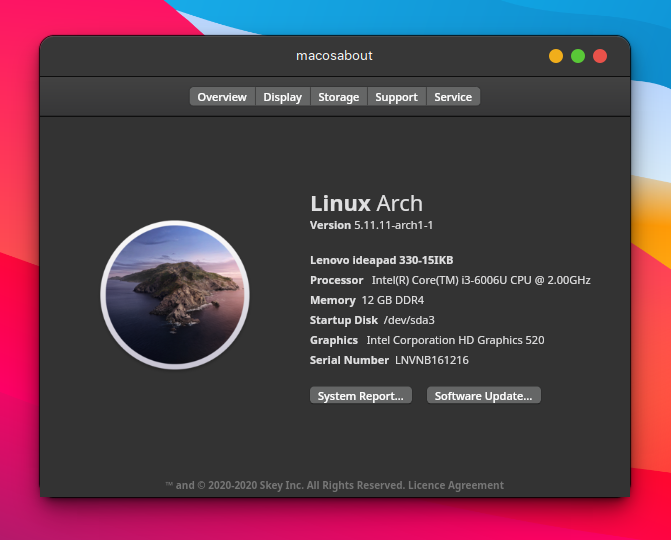
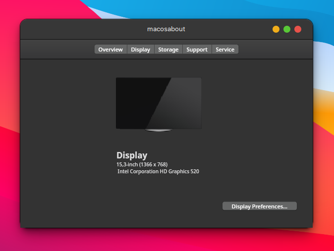
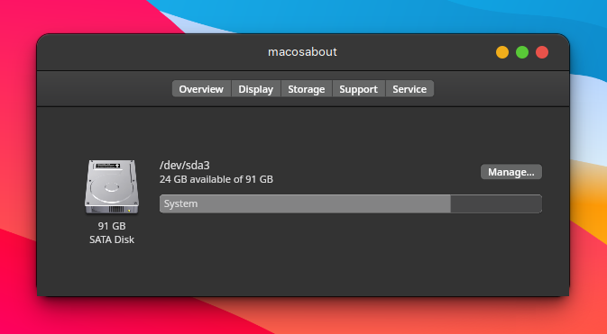
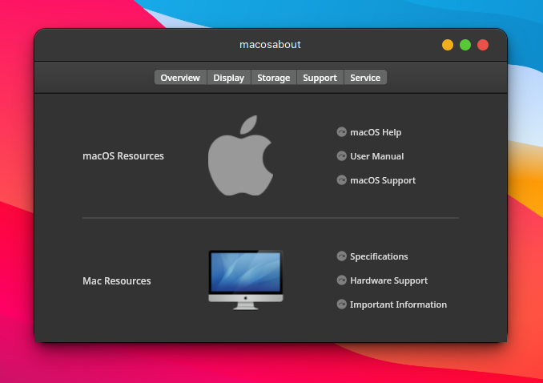
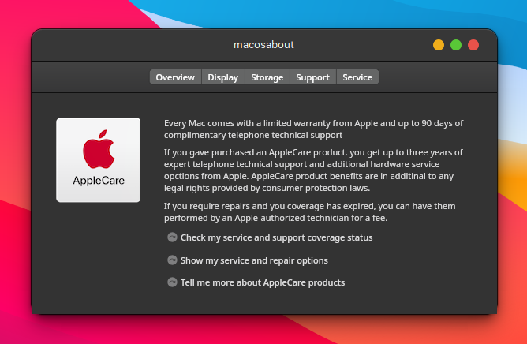

# MacOS About

Desktop system information tool like MacOS Catalina


## Getting Started

This project is a starting point for a Flutter application.

A few resources to get you started if this is your first Flutter project:

- [Lab: Write your first Flutter app](https://flutter.dev/docs/get-started/codelab)
- [Cookbook: Useful Flutter samples](https://flutter.dev/docs/cookbook)

For help getting started with Flutter, view our
[online documentation](https://flutter.dev/docs), which offers tutorials,
samples, guidance on mobile development, and a full API reference.

## Screenshots

    

## Usage example

```
chmod +x macosabout-1.0.0-x86_64.AppImage
```

```
./macosabout-1.0.0-x86_64.AppImage
```

## Development setup

### Install dependencies

[flutter](https://flutter.dev/docs/get-started/install/linux) - To build the binaries files

[appimagetool](https://appimage.github.io/appimagetool/) - To build the AppImage

### Build binaries

```bash
flutter channel master
```

```bash
make
```

## Installation

```bash
make install
```

## Clean binaries

```
make clean
```

## Meta

Odilon Damasceno – [@sirskey](https://twitter.com/sirskey) – odilondamasceno@protonmail.com

Distributed under the GPL-3.0 license. See ``LICENSE`` for more information.

[https://github.com/OdilonDamasceno/macosabout](https://github.com/OdilonDamasceno/macosabout)

## Contributing

1. Fork it (<https://github.com/OdilonDamasceno/macosabout/fork>)
2. Create your feature branch (`git checkout -b feature/fooBar`)
3. Commit your changes (`git commit -am 'Add some fooBar'`)
4. Push to the branch (`git push origin feature/fooBar`)
5. Create a new Pull Request
